# PRESENCE
Android App for Attendance Marking through Facial Recognition and Geofencing.  
## Tech Stack:
<pre>Android(Kotlin), Firebase ,TensorFlow Lite </pre>
• Designed and Developed a Smart Attendance capturing Android App which
uses Facial recognition and Geo-fencing for marking the attendance. 
• This App was developed forthe Smart India Hackathon 2022 and ourteam
was placed in the `Top 3`and we were the `Official Runner-ups.` 
• This app uses TensorFlow lite Face-net model forfacialrecognition which uses
Deep Convolutional Neural Network with accuracy of `99.8 %` in
recognizing face and Google Map API for Geo-fencing. 

 
 
## APP LOGO:
 

 
## Flow of the App:
 
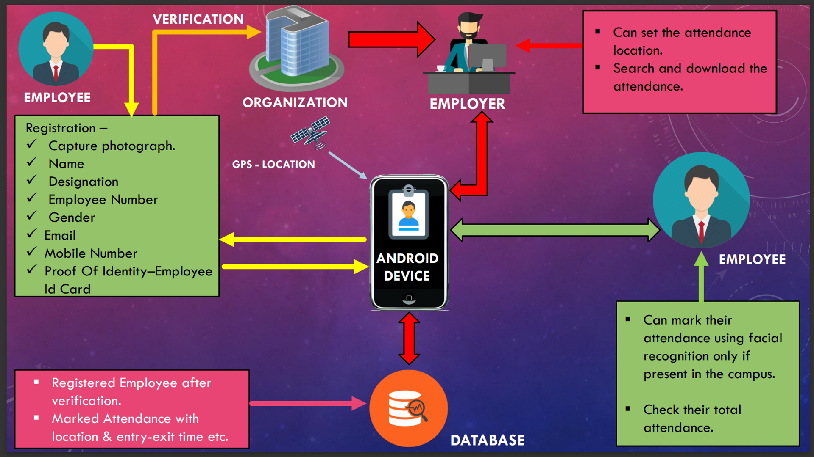 
 
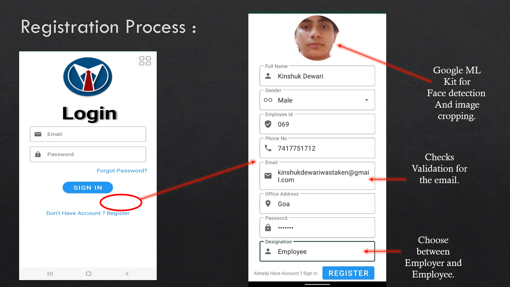 
 
 
 
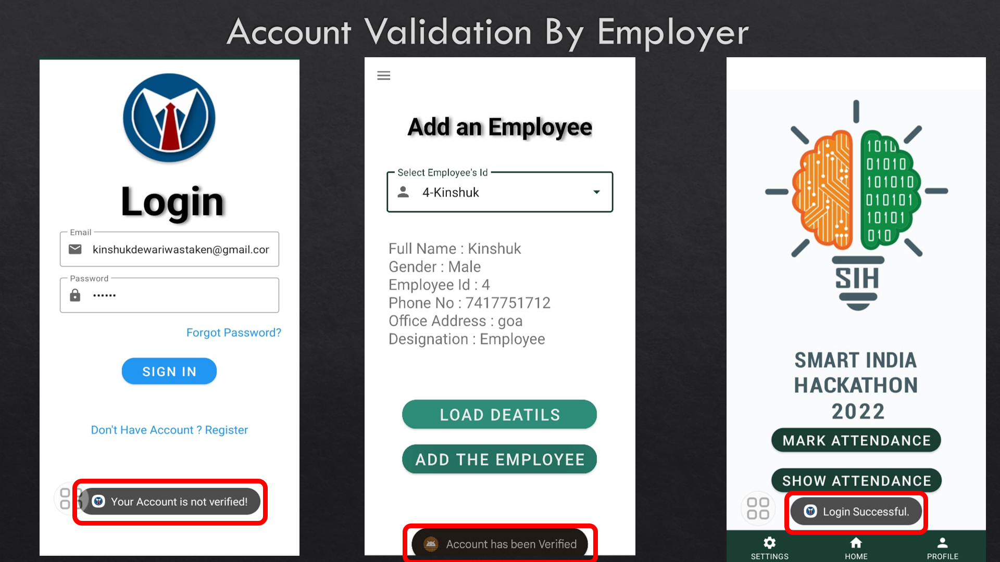 
 
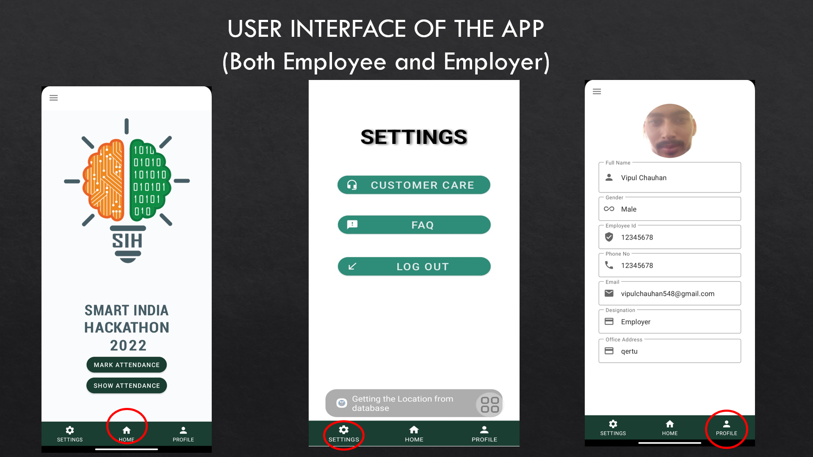 
 
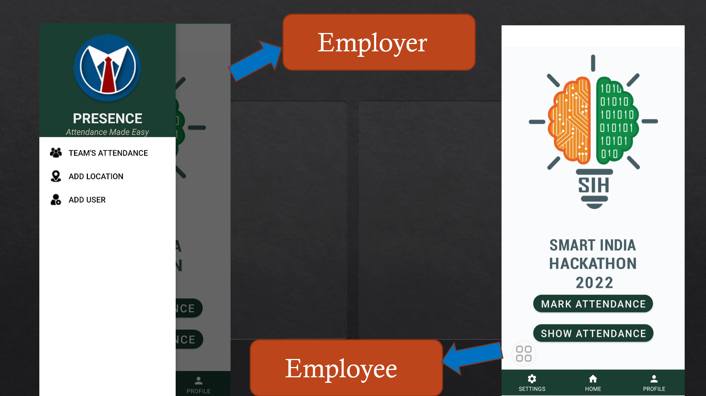 
 
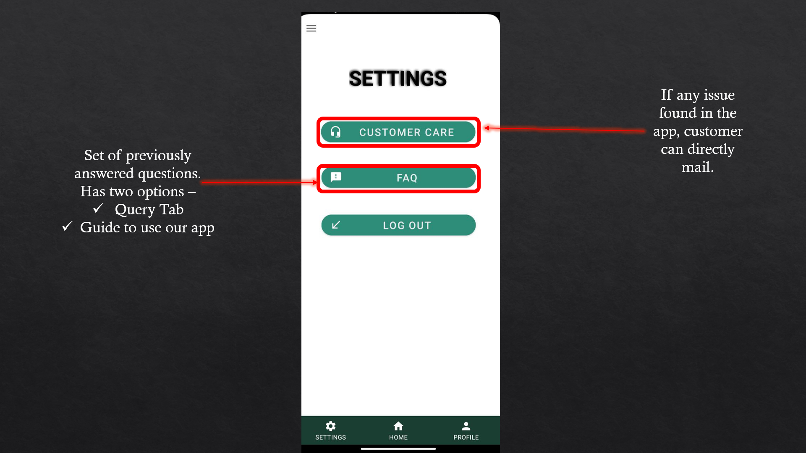 
 
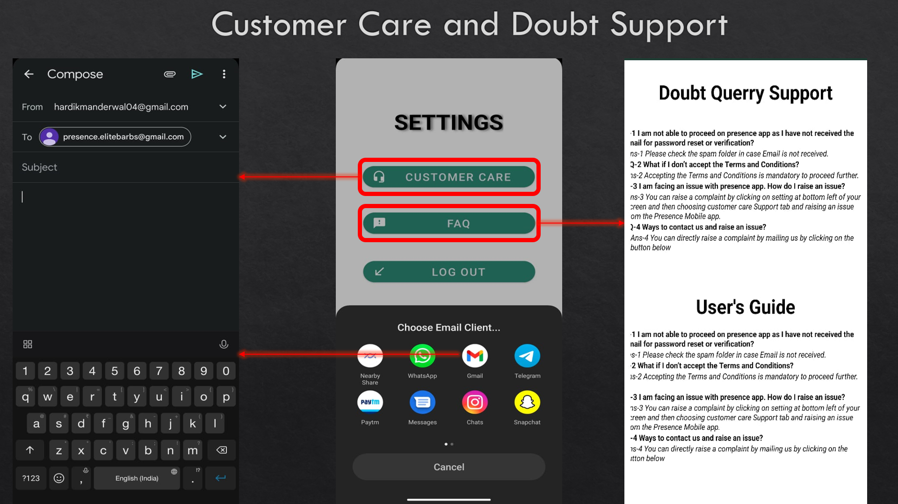 
 
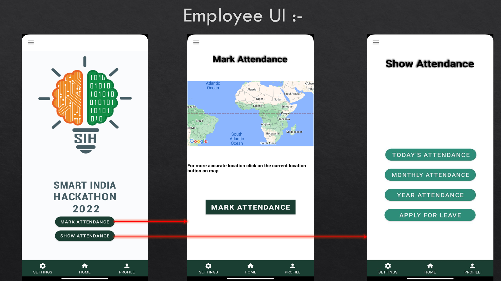 
 
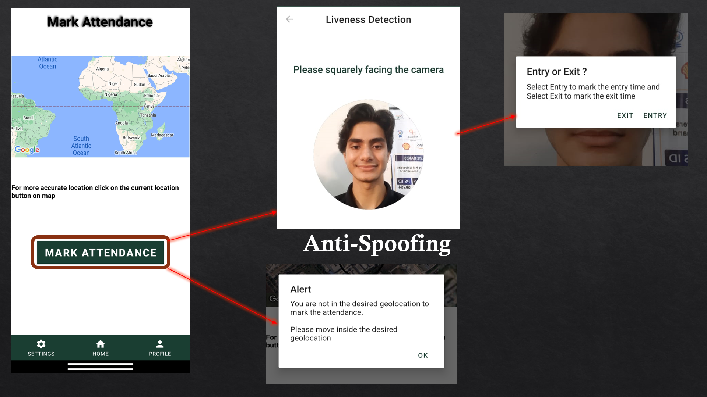 
 
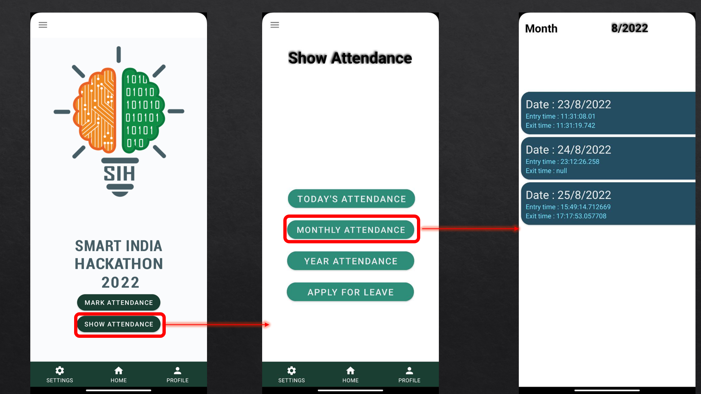 
 
 
 
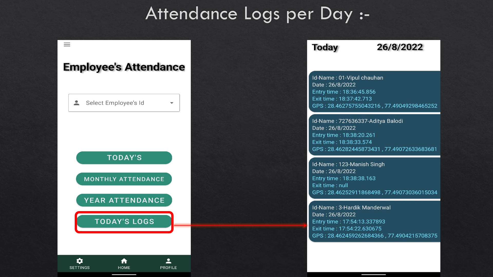 
 
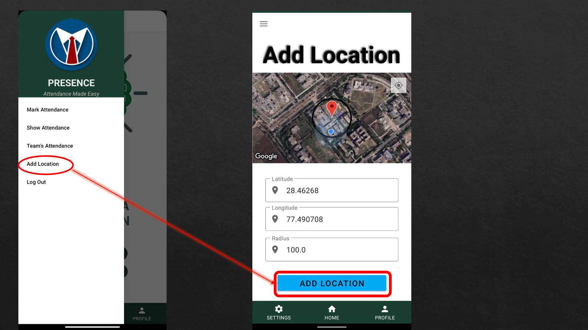
